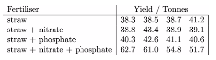

# The hypothesis test (finally)

OK now that you know how to compute the statistic lets perform the hypothesis test that we first talked about when we introduced this series of task.  Recall that a farmer had obtained the following yields when he fertilized 16 cabbage fields in four different ways:

I have loaded this information into a NumPy array called yields in the code in the panel on the left.  __Your task is to complete the code to perform the hypothesis test__.  In this case, the null and alternative hypotheses are that:

* __null hypothesis__: the expected yield when the four different fertilizer treatments are used are all the same. 
* __alternative hypothesis__: there are differences in the expected yields when different fertilizers are used.

To complete the task you need to complete the code in the two functions in the panel on the left.  These functions are:

1. `testStatistic` - this function takes a 2D NumPy array called `data` in input.  The samples from the four different distribution are contained in the rows of this NumPy array.  You need to calculate the error (SSE) and treatment sum of squares (SST) from `data`.  You then calculate the test statistic that we discussed in the last couple of tasks from these values:

}{SS_E/\left[\sum_{j=1}^t(n_j-1)\right]})

2. `pvalue` - this function takes a 2D NumPy array called `data` in input.  The test statistic above is then called by calling `testStatistic`.  Under the assumption of the null hypothesis, this test statistic is a sample from an f-distribution with ) degrees of freedom where N is the sum of all the  values. As we have seen in previous tasks, when the alternative hypothesis is true SST is larger than SSE and F is much larger than one.  You thus need to perform a one-sided test here.  The p-value is the probability of getting a value that is greater than or equal to the test statistic under the assumption of the __null hypothesis__.
